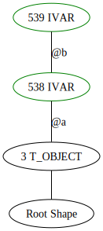
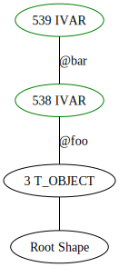
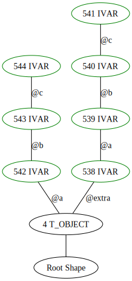
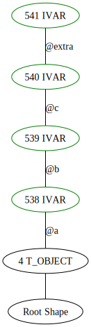
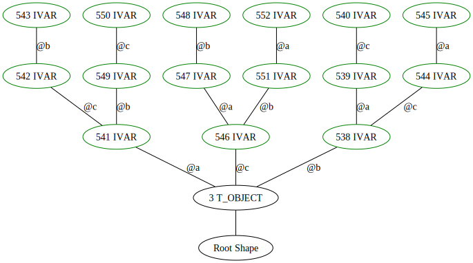
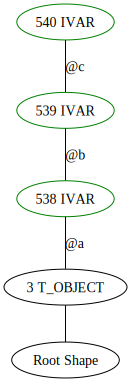

# ShapeViz

Simple Gem to visualize your Ruby programs shape tree using graphviz.

## Installation

Add,

```
gem "ShapeViz", git: git@github.com:HParker/ShapeViz.git
```

to your Gemfile.


## Usage

ShapeViz can wrap blocks of Ruby code and return you a graphviz `dot` file that you can use to visualize the shape tree,

```ruby
class ExampleA
  def initialize
    @a = 1
    @b = 2
  end
end

ShapeViz::Tracker.track do
  ExampleA.new
end
```

this creates `shape-graph.dot` that you can convert into an image using `dot -Tsvg shape-grpah.dot > out.svg`. This will give you a graph like,

You can optionally pass `out: "myfile.dot"` to `track` to change the name of the destination file.



## Full Report

You can update the example above to pass `full: true` as a keyword arg to `track` this will print the whole shape tree and mark edges created within the block in green.

```ruby
class ExampleA
  def initialize
    @a = 1
    @b = 2
  end
end

ShapeViz::Tracker.track(full: true) do
  ExampleA.new
end
```

this returns a large picture so I won't embed it here. [click for image](images/2.rb.svg)

## Non block

If you have code you want to track that doesn't fit nicely in a block you can use this alternative syntax,

```ruby
class ExampleA
  def initialize
    @foo = 1
    @bar = 2
  end
end

tracker = ShapeViz::Tracker.start

ExampleA.new

tracker.stop
tracker.report
```




## Understanding shape

Generally, you want as few shape edges in your application as possible. You can improve your applications shape tree by making sure that instance variables are always defined in the same order.

Here is an example "sub-optimal" object shape due to instance variable order difference in `initialize`

```ruby
class ExampleA
  def initialize(has_extra)
    @extra = 0 if has_extra # this prevents edge node sharing
    @a = 1
    @b = 2
    @c = 3
  end
end

ShapeViz::Tracker.track do
  ExampleA.new(true)
  ExampleA.new(false)
end
```



This can be fixed by updating our example to,

```ruby
class ExampleA
  def initialize(has_extra)
    @a = 1
    @b = 2
    @c = 3
    @extra = 0 if has_extra # this shares edges since it is after the shared ivars
  end
end

ShapeViz::Tracker.track do
  ExampleA.new(true)
  ExampleA.new(false)
end
```



You can end up in similar situations if you use caching methods that are called in different orders,

```ruby
class ExampleA
  def initialize
    [:a, :b, :c].shuffle.each { |m| public_send(m) }
  end

  def a
    @a ||= 1
  end

  def b
    @b ||= 1
  end

  def c
    @c ||= 1
  end
end

ShapeViz::Tracker.track do
  10.times do
    ExampleA.new
  end
end
```



This can be fixed by setting up your instance variables ahead of time,

```ruby
class ExampleA
  def initialize
    @a = nil
    @b = nil
    @c = nil
    [:a, :b, :c].shuffle.each { |m| public_send(m) }
  end

  def a
    @a ||= 1
  end

  def b
    @b ||= 1
  end

  def c
    @c ||= 1
  end
end

ShapeViz::Tracker.track do
  10.times do
    ExampleA.new
  end
end
```



## Development

After checking out the repo, run `bin/setup` to install dependencies. Then, run `rake test` to run the tests. You can also run `bin/console` for an interactive prompt that will allow you to experiment.

To install this gem onto your local machine, run `bundle exec rake install`. To release a new version, update the version number in `version.rb`, and then run `bundle exec rake release`, which will create a git tag for the version, push git commits and the created tag, and push the `.gem` file to [rubygems.org](https://rubygems.org).

## Contributing

Bug reports and pull requests are welcome on GitHub at https://github.com/[USERNAME]/ShapeViz. This project is intended to be a safe, welcoming space for collaboration, and contributors are expected to adhere to the [code of conduct](https://github.com/[USERNAME]/ShapeViz/blob/master/CODE_OF_CONDUCT.md).

## License

The gem is available as open source under the terms of the [MIT License](https://opensource.org/licenses/MIT).

## Code of Conduct

Everyone interacting in the ShapeViz project's codebases, issue trackers, chat rooms and mailing lists is expected to follow the [code of conduct](https://github.com/[USERNAME]/ShapeViz/blob/master/CODE_OF_CONDUCT.md).
